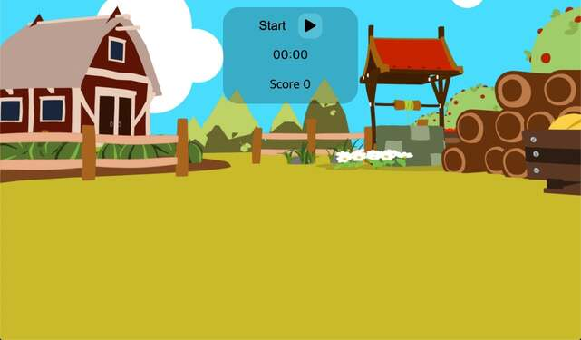
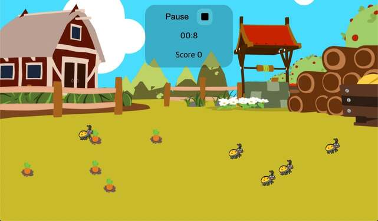
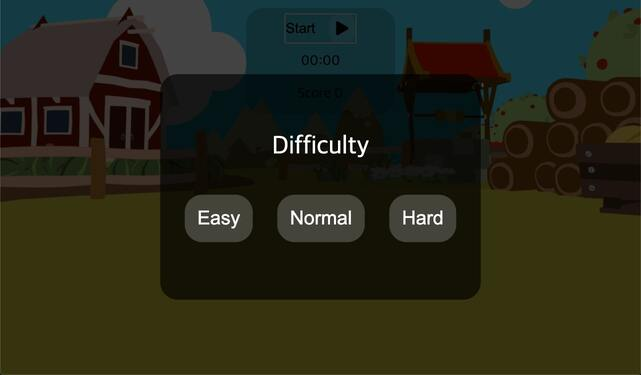
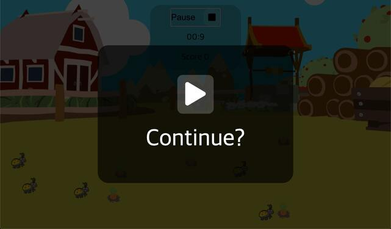
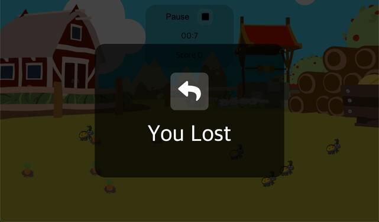
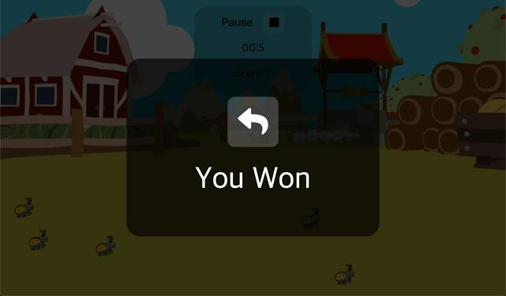

# :video_game::carrot: CARROT GAME :carrot::video_game:

## What is CARROT GAME ?

#### It's a simple game! You win when you collect all the carrots!

#### But time is ticking and be careful with the bugs. If you touch the bug, you will be no longer be able to collect carrots.

<br/>
  
  
:dart: 3 Game levels: Easy, Normal, Hard
 <br/>
  
:dart: Pause button <br/>
You can pause when there is something urgent. <br/> But don't forget to come back and collect all the carrots!
  
  
  

## Setup

To run this project, install it locally using npm:

1. Clone the repo

```bash
git clone https://github.com/Globalkmaria/carrot-game.git
```

2. Go into the folder

```bash
cd carrot-game
```

3. Install NPM packages

```bash
npm i
```

4. Start server

```bash
npm start
```
